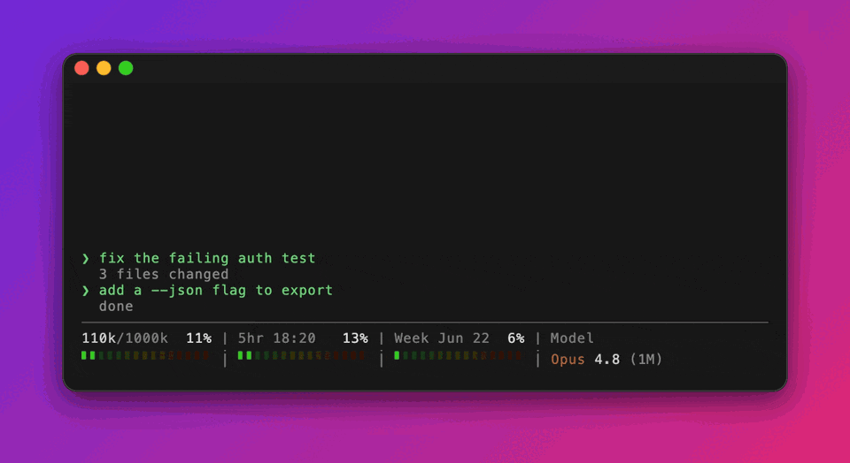
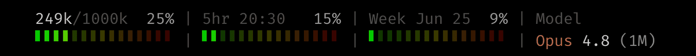

# claude-statusline

[](https://github.com/onury/claude-statusline/releases/latest)
[](LICENSE)


Never get blindsided by a rate limit again. This drop-in status line keeps your
context-window, 5-hour, and weekly usage — and how close each is to its cap — visible at
the bottom of every [Claude Code](https://code.claude.com) prompt.



- **Line 1** — sections separated by ` | ` (default `context,5hr,week,branch`):
  - `used/total` context tokens + context-window `%`
  - `5hr <time>` + 5-hour rate-limit `%`
  - `Week <time>` + 7-day rate-limit `%`
  - `Branch` — the active git branch (shown when the workspace is a git repo)
- **Line 2** — a 16-cell gradient bar under each rate/context section (the `branch`/`model`
  sections show their value here instead).

> [!NOTE]
> For the `5hr` and `Week` sections, the `%` and bar are **quota usage** (how much of the
> window's limit you've consumed), while the time next to the label is the **window clock**
> (see `--time` below). These are independent: `Week -5days … 3%` means 5 days until reset
> *and* only 3% used — low usage doesn't mean more time left, and a near-full bar doesn't
> mean the reset is close.

## Features

- **Per-cell gradient** — every cell owns a color mapped green (0%) → red (100%).
  Fill level is shown by *brightness* (filled cells bright, the track is the same hue
  but dim), so the full green→red sweep is always visible and red only lights up bright
  as you approach a limit.
- **Three brightness tiers** on line 1: dim `/total` < medium used-token count < bright `%`.
- **Right-aligned, brightened `%`** at the end of each bar section (expanded layout; compact
  drops the padding and puts a single space before the `%`).
- **Awaiting placeholders** — the `rate_limits` object is absent before the first API
  response (and for API-key sessions). Until data arrives, the `5hr`/`Week` sections show
  an animated `•••` indicator in place of the numbers, then fill in once it lands — so the
  layout never jumps. API-key sessions never get this data; drop the sections there with
  `--sections context,model`. The context section always shows.
- Top-aligned quarter-cell ticks (`▘`) for a slim look.
- Pure `sh` + `jq` + `awk`; 24-bit truecolor.

## Install

1. Download the script into your Claude Code config dir:

   ```sh
   curl -fsSL https://raw.githubusercontent.com/onury/claude-statusline/main/statusline-command.sh \
     -o ~/.claude/statusline-command.sh
   ```

   <sub>Or, from a clone of this repo: `cp statusline-command.sh ~/.claude/statusline-command.sh`</sub>

2. Point `~/.claude/settings.json` at it:

   ```json
   {
     "statusLine": {
       "type": "command",
       "command": "sh ~/.claude/statusline-command.sh"
     }
   }
   ```

3. Start a new prompt — the status line refreshes automatically.

### Requirements

- `jq` and `awk` on `PATH` (both default on macOS; `awk` is BSD awk there).
- A terminal with 24-bit truecolor support.
- Reset times use macOS/BSD `date -r <epoch>`. On GNU/Linux, change `date -r "$x"` to
  `date -d "@$x"` in the two reset-formatting lines.

## Status line JSON fields used

Claude Code pipes a JSON object to the script on stdin. This script reads:

| Path | Meaning |
|------|---------|
| `.context_window.total_input_tokens`  | input tokens used |
| `.context_window.total_output_tokens` | output tokens used |
| `.context_window.context_window_size` | context window size |
| `.rate_limits.five_hour.used_percentage`  | 5-hour window usage % |
| `.rate_limits.five_hour.resets_at`        | 5-hour reset (Unix epoch) |
| `.rate_limits.seven_day.used_percentage`  | 7-day window usage % |
| `.rate_limits.seven_day.resets_at`        | 7-day reset (Unix epoch) |
| `.model.display_name`                     | model name for the `model` section |
| `.workspace.current_dir` (or `.cwd`)      | working dir for the `branch` section's git lookup |

Terminal width for `--responsive` comes from the `$COLUMNS` environment variable, which
Claude Code sets before each run (requires Claude Code v2.1.153+).

## Customizing

Pass options on the command line in `settings.json` — no need to edit the script:

```json
{
  "statusLine": {
    "type": "command",
    "command": "sh ~/.claude/statusline-command.sh --width 20 --sections context,week"
  }
}
```

| Flag | Default | Description |
|------|---------|-------------|
| `--width N`             | `16`              | Cells per bar / width of each line-1 field (expanded layout; compact fits content). |
| `--glyph CHAR`          | `▘`               | Bar cell character. Must be **single-column** (e.g. `▖` bottom, `▌` full height, `█` full block, `▂` quarter height). |
| `--sections LIST`       | `context,5hr,week,branch` | Comma-separated sections to show, **in the order given**. Any subset of `context`, `5hr`, `week`, `branch`, `model`. (`tokens` is accepted as a legacy alias for `context`.) |
| `--time MODE`           | `reset`           | What the `5hr`/`Week` time field shows. `reset` — the reset point (`@23:00`, `@Jun25`); `remaining` — time left, ticking down (`-04:30`, `-6days`); `elapsed` — time used, ticking up (`+00:30`, `+1day`). `@` = at, `-` = before reset, `+` = since start. The week switches to the `-HH:MM`/`+HH:MM` clock once under a day. |
| `--fill F`              | `0.80`            | Brightness (`0`–`1`) of filled bar cells. |
| `--track F`             | `0.22`            | Brightness (`0`–`1`) of the unfilled track. |
| `--responsive true\|false` | `true`         | When the line is wider than the terminal, drop sections **from the right** until it fits. |
| `--layout expanded\|compact` | `expanded`   | `expanded` — the default two-line view (text + bars). `compact` — a **single line**: drops the line-2 bars and the `branch`/`model` sections show their value (e.g. `main`, `Opus 4.8 (1M)`) in place of the label. |

Unknown flags are ignored, and any section whose data is absent is skipped. The `branch`
and `model` sections are turned on or off purely by listing (or omitting) them in
`--sections` — there are no separate `--branch`/`--model` flags.

> [!TIP]
> **Set [`refreshInterval`](https://code.claude.com/docs/en/statusline) only when using `--time remaining` or `--time elapsed`.** Claude Code re-runs the status line on session activity (a new message, tool call, etc.), so a ticking clock looks frozen while you sit idle. Add `refreshInterval` (seconds) next to `command` to make it advance on its own — `10` is a good balance for the minute-level clock:
>
> ```json
> "statusLine": {
>   "type": "command",
>   "command": "sh ~/.claude/statusline-command.sh --time remaining",
>   "refreshInterval": 10
> }
> ```
>
> With the default `--time reset`, the field is a fixed point that changes only on activity anyway, so a timer would just re-run the script for no visible gain — leave `refreshInterval` off.
>
> Note: `resets_at` only refreshes on session activity, so an idle countdown can reach the reset before fresh data arrives. When that happens the field shows an animated `•••` "awaiting" indicator (rather than a stuck `-00:00`) until the next update lands. The dot advances one step **per render** regardless of `refreshInterval` (so no interval can freeze it) — `1` gives a fast spin, the default `10` a gentle one. It only touches a tiny temp file while the indicator is on screen; normal renders write nothing.

### Branch section

In the default section list, a section shows the active **git branch** — the `Branch` label on line 1
and the branch name on line 2 (in blue). The branch is read from the workspace dir
(`.workspace.current_dir`, falling back to `.cwd`); a detached `HEAD` shows the short commit hash,
and the section is skipped entirely when the directory isn't a git repo. Drop it with a
`--sections` list that omits `branch` (e.g. `--sections context,5hr,week`).

### Model section

Add `model` to `--sections` (e.g. `--sections context,5hr,week,branch,model`) to show the active model —
the `Model` label on line 1 and the name on line 2, colored in tiers: family (Claude orange),
version (dim white), context (dim gray). Sections render in the order you list them.



### Compact layout (single line)

With `--layout compact`, the status line collapses to **one line** — the line-2 bars are dropped, and the
`branch`/`model` sections show their value directly (since there's no second line to hold it):

```
191k/1000k 19% | 5hr -02:37 12% | Week -6days 7% | main | Opus 4.8 (1M)
```

Every section fits its own content — without a second line to align pipes to, there's no
bar-width padding, just a single space before each gradient-colored `%` (and the `branch` (blue)
and `model` values stand on their own). Pairs naturally with `--time remaining` or `--time elapsed`.

### Responsive

With `--responsive true` (the default), the script reads the `$COLUMNS` environment variable
(set by Claude Code to the terminal width) and drops sections from the right — least-important
first (`model`, then `branch`, `week`, …) — until the line fits. The leftmost section (`context`) is always
kept. Set `--responsive false` to always render every section even if it wraps.

In the expanded layout both lines share the same per-section `--width` and ` | ` separator, so the pipes stay vertically aligned — a field that overflows `--width` is clipped (only the last field may overflow), and a multi-column `--glyph` breaks this. When `--width` is too narrow to hold a section plus its `%`, the `%` is dropped (the bar underneath still shows the level). For the `5hr`/`Week` sections the label then stays pinned left while the time value (e.g. `-02:35`, `-6days`) right-aligns into the freed space; the context section stays left-aligned. Compact is a single line with nothing to align beneath it, so fields just fit their content.

## `/sl` slash command (optional)

A small [custom slash command](https://docs.claude.com/en/docs/claude-code/slash-commands) for
**changing the status line from inside Claude Code** — no need to hand-edit `settings.json`. It's two
files: [`commands/sl.md`](commands/sl.md) (the command) and [`sl-config.sh`](sl-config.sh) (the helper
it calls). Install both:

```sh
mkdir -p ~/.claude/commands
curl -fsSL https://raw.githubusercontent.com/onury/claude-statusline/main/commands/sl.md \
  -o ~/.claude/commands/sl.md
curl -fsSL https://raw.githubusercontent.com/onury/claude-statusline/main/sl-config.sh \
  -o ~/.claude/sl-config.sh
```

<sub>Or, from a clone: `cp commands/sl.md ~/.claude/commands/ && cp sl-config.sh ~/.claude/`. Restart Claude Code to pick it up.</sub>

Then, in any session:

```
/sl compact               switch to the single-line layout
/sl expanded              back to two lines
/sl context,branch,model  set the sections (comma list, in order)
/sl model off             add/remove a section
/sl time remaining        change the time mode
/sl width 18              set the bar/field width
/sl help                  list all options
/sl                       show the current config
```

It edits the `--flag`s on your `statusLine.command`, **changing only what you named and keeping the
rest**, then writes it back to `settings.json` — so the change **persists** across sessions (it isn't
a session-only toggle). The new look applies on the next status line refresh.

The command itself is a one-line wrapper: it just runs the bundled `sl-config.sh`, which does the
request→flag mapping deterministically in shell. Earlier versions baked the whole mapping into the
slash-command prompt and let the model work it out on every call; moving it into the script does the
**same edits for ~10× fewer tokens and near-instantly** — there's no model reasoning to parse the
request, just one command. (Behavior is identical: same requests, same flags, same in-place write.)

## Testing

Pipe sample JSON through it (strip ANSI to read the layout):

```sh
echo '{"context_window":{"total_input_tokens":58000,"total_output_tokens":2000,"context_window_size":200000},"rate_limits":{"five_hour":{"used_percentage":45,"resets_at":1750346400},"seven_day":{"used_percentage":20,"resets_at":1750600800}}}' \
  | sh statusline-command.sh | sed 's/\x1b\[[0-9;]*m//g'
```

To preview specific values for a screenshot, temporarily hardcode them after the parsing
block, e.g. `tok_pct=82; fh_pct=37; wk_pct=53`, then remove the override.

## Changelog

See [CHANGELOG.md](CHANGELOG.md).

## License

[MIT](LICENSE) © Onur Yıldırım
