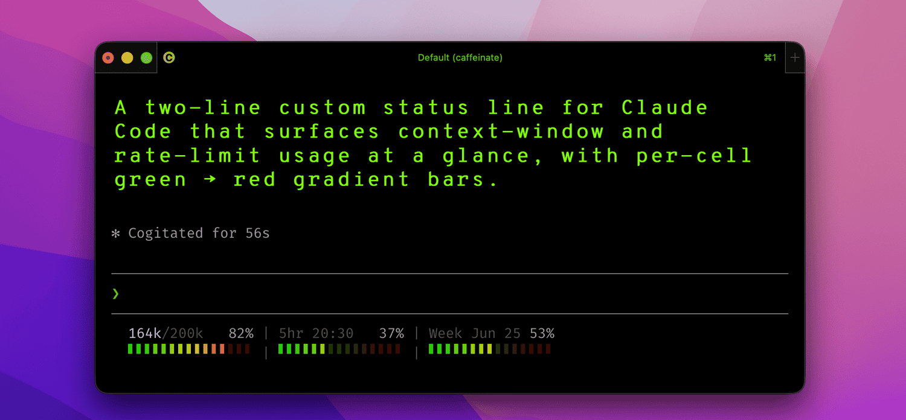

# claude-statusline

Never get blindsided by a rate limit again. This drop-in status line keeps your
context-window, 5-hour, and weekly usage — and how close each is to its cap — visible at
the bottom of every [Claude Code](https://code.claude.com) prompt.



- **Line 1** — three sections separated by ` | `:
  - `used/total` tokens + context-window `%`
  - `5hr <reset time>` + 5-hour rate-limit `%`
  - `Week <reset date>` + 7-day rate-limit `%`
- **Line 2** — a 15-cell gradient bar under each section.

## Features

- **Per-cell gradient** — every cell owns a color mapped green (0%) → red (100%).
  Fill level is shown by *brightness* (filled cells bright, the track is the same hue
  but dim), so the full green→red sweep is always visible and red only lights up bright
  as you approach a limit.
- **Three brightness tiers** on line 1: dim `/total` < medium used-token count < bright `%`.
- **Right-aligned, brightened `%`** at the end of each section.
- **Graceful degradation** — the `rate_limits` object is absent for API-key sessions and
  before the first API response; those sections (and their bars) simply don't render until
  data exists. The token section always shows.
- Top-aligned quarter-cell ticks (`▘`) for a slim look.
- Pure `sh` + `jq` + `awk`; 24-bit truecolor.

## Install

1. Copy the script into your Claude Code config dir:

   ```sh
   cp statusline-command.sh ~/.claude/statusline-command.sh
   ```

2. Point `~/.claude/settings.json` at it:

   ```json
   {
     "statusLine": {
       "type": "command",
       "command": "sh ~/.claude/statusline-command.sh"
     }
   }
   ```

3. Start a new prompt — the status line refreshes automatically.

### Requirements

- `jq` and `awk` on `PATH` (both default on macOS; `awk` is BSD awk there).
- A terminal with 24-bit truecolor support.
- Reset times use macOS/BSD `date -r <epoch>`. On GNU/Linux, change `date -r "$x"` to
  `date -d "@$x"` in the two reset-formatting lines.

## Status line JSON fields used

Claude Code pipes a JSON object to the script on stdin. This script reads:

| Path | Meaning |
|------|---------|
| `.context_window.total_input_tokens`  | input tokens used |
| `.context_window.total_output_tokens` | output tokens used |
| `.context_window.context_window_size` | context window size |
| `.rate_limits.five_hour.used_percentage`  | 5-hour window usage % |
| `.rate_limits.five_hour.resets_at`        | 5-hour reset (Unix epoch) |
| `.rate_limits.seven_day.used_percentage`  | 7-day window usage % |
| `.rate_limits.seven_day.resets_at`        | 7-day reset (Unix epoch) |

## Customizing

Pass options on the command line in `settings.json` — no need to edit the script:

```json
{
  "statusLine": {
    "type": "command",
    "command": "sh ~/.claude/statusline-command.sh --width 20 --sections tokens,week"
  }
}
```

| Flag | Default | Description |
|------|---------|-------------|
| `--width N`       | `15`              | Cells per bar / width of each line-1 field. |
| `--glyph CHAR`    | `▘`               | Bar cell character. Must be **single-column** (e.g. `▖` bottom, `▌` full height, `█` full block, `▂` quarter height). |
| `--sections LIST` | `tokens,5hr,week` | Comma-separated sections to show, in order. Any subset of `tokens`, `5hr`, `week`. |
| `--time FMT`      | `%H:%M`           | `strftime` format for the 5-hour reset clock. |
| `--date FMT`      | `%b %d`           | `strftime` format for the weekly reset date. |
| `--fill F`        | `0.80`            | Brightness (`0`–`1`) of filled bar cells. |
| `--track F`       | `0.22`            | Brightness (`0`–`1`) of the unfilled track. |

Unknown flags are ignored, and any section whose data is absent is skipped.

### Pipe alignment is always preserved

Both lines use the same per-section width and ` | ` separator, so the pipes stay vertically
aligned under any settings. If a custom `--date`/`--time` makes a field overflow `--width`,
every **non-last** field is clipped to exactly `--width` (so later pipes don't shift); only
the **last** field is allowed to overflow, since nothing follows it. Widen with `--width` if
a format gets clipped. Note: a multi-column `--glyph` (e.g. an emoji) will break alignment.

## Testing

Pipe sample JSON through it (strip ANSI to read the layout):

```sh
echo '{"context_window":{"total_input_tokens":58000,"total_output_tokens":2000,"context_window_size":200000},"rate_limits":{"five_hour":{"used_percentage":45,"resets_at":1750346400},"seven_day":{"used_percentage":20,"resets_at":1750600800}}}' \
  | sh statusline-command.sh | sed 's/\x1b\[[0-9;]*m//g'
```

To preview specific values for a screenshot, temporarily hardcode them after the parsing
block, e.g. `tok_pct=82; fh_pct=37; wk_pct=53`, then remove the override.

## License

[MIT](LICENSE) © Onur Yıldırım
